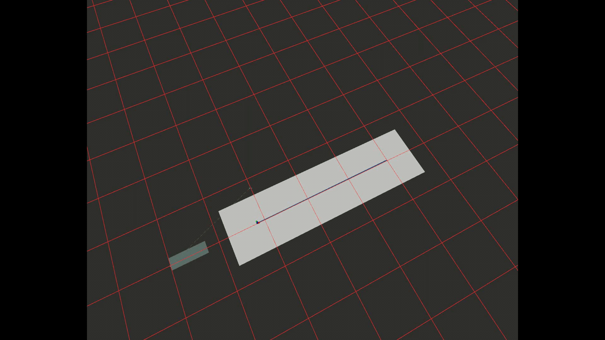

# Obstacle Avoidance
## Key features
- This code uses the RRT*-algorithm for collision avoidance at a fixed altitude
- 3D obstacle detection using the Intel D435 camera
- redirecting the UAV onto the predefined mission path (ideal for photogrammetry missions)
- paths smoothing
- uses octomap for obstacle mapping

> **Note:** Collision prevention at a cruise velocity of 6 m/s.

> **Note:** Collision avoidance at a cruise velocity of 6 m/s.

Blue line: followed path
Green line: alternative suggested path 

# Instructions
## Getting Started
See also: 
- [Paper: Utilizing the RRT*-Algorithm for Collision Avoidance in UAV Photogrammetry Missions]( https://arxiv.org/abs/2108.03863 )
- [Gazebo and ROS setup](https://docs.px4.io/master/en/simulation/ros_interface.html)

### Add to `.bashrc`: 
> **Note:** Your catkin workspace is assumed to be in `~/catkin_ws`.
- `export GAZEBO_MODEL_PATH=$GAZEBO_MODEL_PATH:~/catkin_ws/src/px4_rrt_avoidance/include/gazebo_models`

### QGC (QGroundControl): \
- set parameter `COM_OBS_AVOID = 1`
- select mission mode 

# Recommendations 
- We recommend testing the code in the safe simulation software Gazebo 

## Run RRT-Star collision avoidance simulation
run the following commands: 
- `roslaunch px4_rrt_avoidance iris_depth.launch`
- `rosrun px4_rrt_avoidance Master_node.py`

# To-Do's:
- [ ] Some topics/msg can be changed into services
- [ ] Create ROS-parameters to adjust the basic variables
- [ ] Before take-off: obstacle must be visible otherwise /projected_map is not being published
- [ ] When altitude is not correct: mapping error (ground detected as obstacle)
- [ ] Obstacle avoidance below 5 meters ignored (ground mapping issue)
- [ ] Drone stops at the end of mission: changes yaw angle to zero (EAST)
- [ ] New ROS-parameter: change distance for incremental WP's 
- [ ] Sequential start of the master node
- [ ] Solely allow flight direction to be within the visual field of view
- [ ] Huge obstacle (e.g., building): incremental WP lays within a free cell of the grid map, but can't be reached -- create a service when the map has reached the maximum number of iterations and RRT* still can't find a solution to skip this WP 
